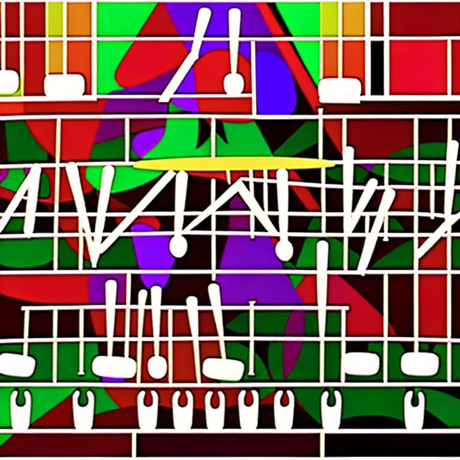

# audio2img
This project aims to fine-tune a __Wav2Vec2Bert__ model to generate audio embeddings that can be used in place of traditional __CLIP__ text embeddings. By integrating audio embeddings, we can leverage the unique properties of audio data to unlock new possibilities for __Stable Diffusion__ models.

<p align="center">
  
</p>

<p align="center">
        🤗 <a href="https://huggingface.co/youzarsif/wav2vec2bert_2_diffusion"> Model on Hugging Face</a>&nbsp |   <a href="https://colab.research.google.com/drive/1F-3C3iSj-xhss2ueRUi6s8h5nCB7fS-X?usp=sharing">📝 Training Notebook</a>&nbsp 
<br>

        
## Introdution
Audio contains a wealth of information that often goes untapped, extending far beyond what we typically imagine. With the rise of __Latent Diffusion__ models and their impressive generative capabilities, there is a growing interest in exploring diverse conditioning techniques. The most common approach involves using __CLIP__ (Contrastive Language-Image Pre-Training) text encoders to condition the model. However, audio data offers a rich and multifaceted source of information that can significantly enhance the conditioning process.


## Inference

<div style="display: flex; flex-direction: row; align-items: center;">
  
  [firework-show-short-64657.webm](https://github.com/user-attachments/assets/f6bdef61-fe73-438a-901d-c13330bf371e)
  
  
  
</div>

<div style="display: flex; flex-direction: row; align-items: center;">

  [pianos-by-jtwayne-7-174717.webm](https://github.com/user-attachments/assets/1760dec7-b13c-4042-a623-ec74ebe18b4c)

  
  
</div>

<div style="display: flex; flex-direction: row; align-items: center;">
  
  [thunder_3-144891-B-19.webm](https://github.com/user-attachments/assets/0de0c7e3-dd00-4305-bd92-6cd70f15911d)

  
  
</div>


<div style="display: flex; flex-direction: row; align-items: center;">
  
  [wafb_fill_acoustic_105_soundcity1-85457.webm](https://github.com/user-attachments/assets/384e4250-b11b-4d7e-b558-d7bc77d03080)

  
  
</div>


## Training Process
The core idea behind our training process is to achieve __cross-modal alignment__ between audio and text embeddings using a __two-stream architecture__. This involves leveraging the powerful __CLIPTextModel__ to generate text embeddings that serve as true labels for the audio embeddings produced by our __Wav2Vec2Bert__ model. Here’s a detailed explanation:
1. **Two-Stream Architecture:**

    **- Text Stream:** We use the __CLIPTextModel__ to generate text embeddings for given text inputs. These embeddings capture rich semantic information and serve as the __ground truth labels__. 
    
    **- Audio Stream:** Our __Wav2Vec2Bert__ model use __convolutional feature encoder__ followed by a __transformer network__ to processes audio inputs and generate corresponding audio embeddings.
2. **Cross-Modality Alignment:**

    **- Objectif:** The primary goal of the training is to align the audio embeddings with the text embeddings in a __shared embedding space__. This ensures that semantically similar audio and text inputs are mapped close to each other.
    
    **- Loss Function:** We achieve this alignment using __Contrastive loss__ which encourages the model to bring embeddings of matching audio-text pairs __closer__ while __pushing__ apart embeddings of non-matching pairs. 

This is similar to how the original __CLIP__ model was trained to align image-text pairs. The difference is that in the __OpenAI__ __CLIP__ model, contrastive loss was computed using the __[CLS] token__, while we will apply contrastive loss at the __sequence level__. 

This image can explain the logic behind this loss:

     

__Transformers__ library was used for the training. __"facebook/w2v-bert-2.0"__ checkpoint was loaded as initial __pretrained__ model. Data preparation, training details, and the hyperparameters used can be found in the __train_me.ipynb__ notebook:
1. **Dataset:** We used the __nateraw/fsd50k__ (Freesound Database 50K) dataset, which can be found on __Hugging Face__, consisting of __sound events__ and their corresponding __descriptions__.   
2. **Adapter:** A convolutional adapter was added on top of the transformer architecture to __downsample__ the dimensionality and match the CLIP text embedding size.

```python
model = Wav2Vec2BertModel.from_pretrained(
    "facebook/w2v-bert-2.0",
    add_adapter=True,
    adapter_kernel_size=3,
    adapter_stride=2,
    num_adapter_layers=2,
    layerdrop=0.0,
    )
```
3. **Contrastive loss implementation:** We can implement the loss function with __PyTorch__ by __subclassing__ the __Trainer class__ and __overriding__ the default loss.

```python
def Contrastive_loss(embeddings1, embeddings2, temperature=0.15):
    cos_sim = torch.cosine_similarity(embeddings1.unsqueeze(1), embeddings2.unsqueeze(0), dim=-1)
    cos_sim = cos_sim / temperature 
    labels = torch.arange(embeddings1.size(0)).unsqueeze(1).repeat(1, embeddings1.size(1)).to(embeddings1.device)    
    loss = F.cross_entropy(cos_sim, labels)   
    return loss

class TrainBert(Trainer):
    def __init__(self,*args,**kwargs):
        super().__init__(*args,**kwargs)
    def compute_loss(self, model, inputs, return_outputs=False):
        labels = inputs.pop("text_embeddings")
        outputs = model(**inputs)
        outputs=outputs.last_hidden_state
        loss = Contrastive_loss(outputs, labels)
        outputs = (loss, outputs)
        return (loss, outputs) if return_outputs else loss
```
4. **Metrics:** We compute __Euclidean Distance__, __Cosine Similarity__, and __Mean Squared Error__, and use them as metrics, they can give us a view of how well the model is evolving to achieve alignment.

__NB:__  __Batch size__ is a __crucial hyperparameter__ to tune, as it defines how many __negative samples__ are passed to the model.
## Usage
1. **install dependencies:**

```bash
      pip install -r requirements.txt
```
2. **download pretrained model:**

ckpt 1728 or ckpt 2016
```python
Wav2Vec2BertModel.from_pretrained('youzarsif/wav2vec2bert_2_diffusion')
```
or
```python
Wav2Vec2BertModel.from_pretrained('youzarsif/wav2vec2bert_2_diffusion_ckpt_1728')
```

3. **Stable diffusion:**

Feel free to use any variation of __Stable Diffusion__, __ControlNet__, or similar models, as long as they utilize the same __CLIP encoder__.
```python
StableDiffusionPipeline.from_pretrained("stabilityai/stable-diffusion-2-1")
```
4. **Gradio interface:**
```bash
python3 app.py
```
## Fast setup
**Directly build and run Docker image:**
```bash
docker build -t app.py .
docker run -p 7860:7860 app.py 
```
## Potential Improvements 
During training, it was observed that the dataset used was __poorly annotated__ and relied on generic labels. Utilizing a more __diverse__ and __well-elaborated__ dataset will enhance the model's __performance__.

Additionally, due to resource limitations, a small convolution adapter was used. Using a __bigger adapter__ to match the __CLIP__ max sequence length can indeed improve model performance, as it allows the model to __capture__ more information .

## Reference

https://github.com/Stability-AI/stablediffusion/tree/main

https://github.com/openai/CLIP/tree/main

https://huggingface.co/docs/transformers/en/model_doc/wav2vec2-bert
